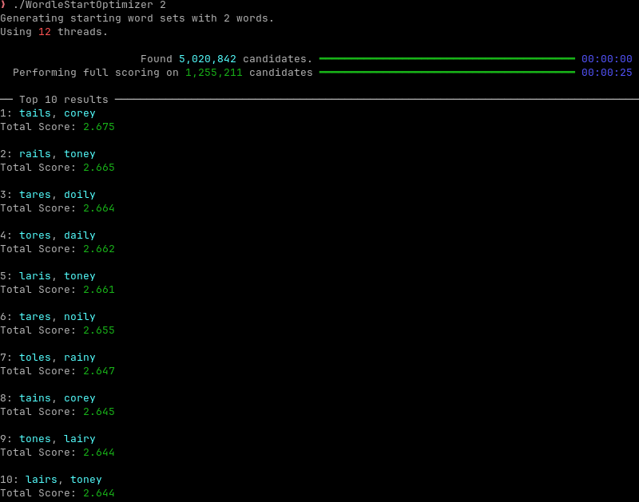
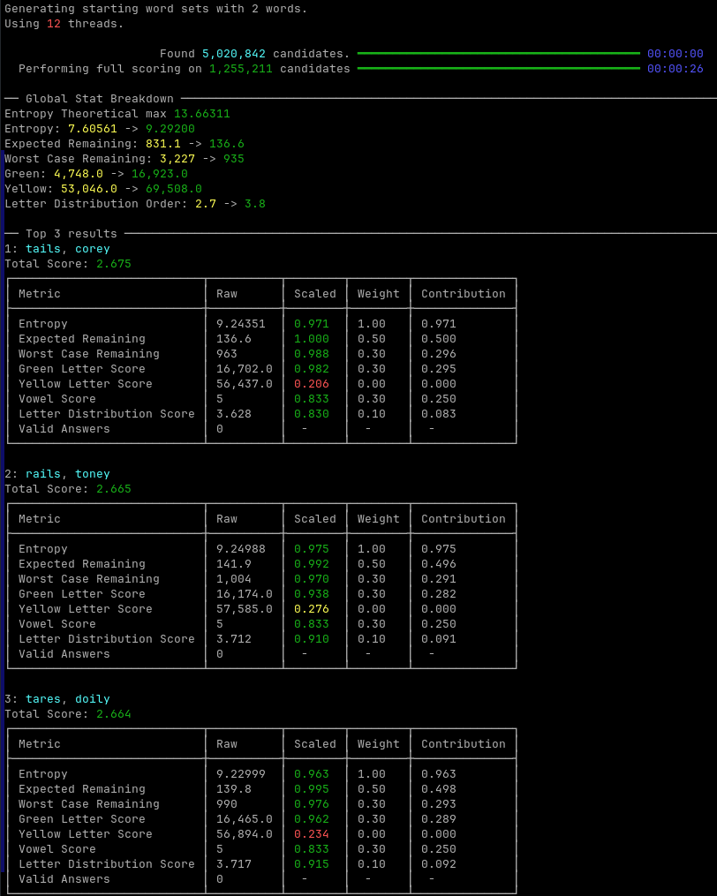

# Wordle Start Optimizer

I'm bad at wordle. So rather then getting better, I thought I'd use a skill I actually have to cheat and make the game easier (⌐■_■)

A command-line tool that searches for high-quality sets of Wordle opening words.

Rather than ranking individual words, Wordle Start Optimizer searches combinations of 2–5 words and scores them using a weighted combination of entropy, solution-space reduction, letter coverage, and other heuristics.


## Features

* Searches every valid combination of **2–5 starting words**
* Eliminates combinations containing duplicate letters
* Multi-threaded search for improved performance
* Configurable scoring weights
* Adjustable search effort to trade accuracy for speed
* Detailed scoring breakdowns
* Optional letter frequency visualization
* Finds optimal opening sets instead of relying on "vibes"

## How It Works

The optimizer works in two stages.

### Candidate Generation

The program generates possible opening word combinations while enforcing one important rule:

> No letter may appear more than once across the entire starting set.

Each candidate receives a quick pre-score based on the combined entropy of its words. This allows weaker candidates to be discarded before expensive evaluation.

### Full Scoring

The strongest candidates are evaluated against the Wordle answer list.

For every possible answer, the program calculates the feedback pattern produced by the opening set. These patterns are then used to measure how effectively the opening words reduce uncertainty.

In other words:

> It spends thousands of guesses so you don't have to.

## Scoring

Each metric is normalized between **0 and 1**, multiplied by its configured weight, and combined into a final score.

The default scoring model attempts to balance mathematical information gain with practical human play.

### Entropy

Measures how evenly the opening set divides possible answers.

Higher entropy means the guesses produce more varied feedback patterns, giving more useful information.

Higher is better.

---

### Expected Remaining

Measures the average number of possible answers remaining after the opening guesses.

Lower is better.

---

### Worst Case Remaining

Measures the largest possible answer group left after the least useful feedback pattern.

This prevents opening sets that are usually good but occasionally leave hundreds of possibilities.

Lower is better.

---

### Green Letters

Rewards guesses that are likely to reveal correctly positioned letters.

Higher is better.

---

### Yellow Letters

Rewards guesses that reveal correct letters in incorrect positions.

Disabled by default because other metrics already capture much of this information.

Also higher isn't neccersarily better, as the higher the score, the more likely a set is to produce anagram.

---

### Vowel Coverage

Rewards sets containing a variety of vowels.

Not mathematically perfect, but humans tend to appreciate discovering that their mystery word contains actual vowels.

Higher is better.

---

### Letter Distribution

Rewards commonly occurring Wordle letters and prioritizes stronger words earlier in the opening sequence.

Higher is better.

---

## Search Effort

Fully scoring every candidate is expensive.

The optimizer first performs a quick pre-score, then only fully evaluates the strongest candidates.

| Effort | Candidates Fully Scored |
| ------ | ----------------------: |
| Low    |                  Top 5% |
| Normal |                 Top 25% |
| High   |                 Top 50% |
| Max    |              Everything |

## Usage

Run with:

```bash
WordleStartOptimizer <setSize> [options]
```

Where `<setSize>` is between **2** and **5**.

---

Generate a 2-word opening set:

```bash
WordleStartOptimizer 2
```



Perform the maximum search:

```bash
WordleStartOptimizer 2 --effort Max
```

Show detailed scoring for top 3 results:

```bash
WordleStartOptimizer 2 --verboseScoring --top 3
```



Generate an opening set that promotes anagrams:

```bash
WordleStartOptimizer 4 -y 1.0 -g -0.3 -e 0.5
```

###### AI disclaimer: I used AI to assist with documentation and licensing.